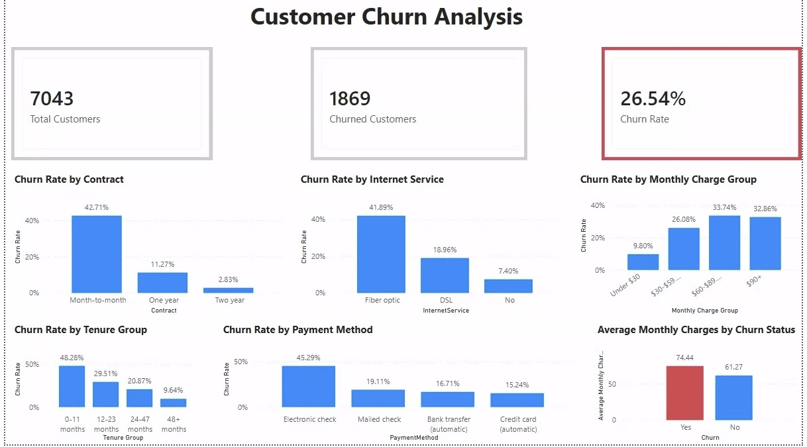

# Customer Churn Analysis

## Project Overview

This project analyzes customer churn patterns in a telecom dataset using Python, SQL, and Power BI.

The goal is to identify customer segments with higher churn risk, understand the factors associated with churn, and translate the findings into practical business recommendations.

## Tools Used

- Python
- Pandas
- MySQL
- SQL
- Power BI
- Git / GitHub

## Project Workflow

1. Cleaned and prepared the raw telecom customer churn dataset using Python and Pandas.
2. Loaded the cleaned dataset into MySQL.
3. Used SQL to analyze churn patterns across contract type, tenure, internet service, payment method, and monthly charges.
4. Built a Power BI dashboard to visualize the main churn drivers and customer risk segments.
5. Summarized the findings into business insights and recommendations.

## Power BI Dashboard

An interactive Power BI dashboard was developed to present the key customer churn metrics and highlight customer segments associated with elevated churn.

The dashboard includes:

- Total Customers, Churned Customers, and Overall Churn Rate KPIs
- Churn Rate by Contract Type
- Churn Rate by Customer Tenure
- Churn Rate by Internet Service
- Churn Rate by Payment Method
- Churn Rate by Monthly Charge Group
- Average Monthly Charges by Churn Status

## Key Business Insights

### 1. Contract Type
Customers with month-to-month contracts have the highest churn rate at **42.71%**, compared with **11.27%** for one-year contracts and only **2.83%** for two-year contracts.

**Business insight:** Longer-term contracts are strongly associated with customer retention.

### 2. Customer Tenure
Churn is highest among newer customers:

- 0–11 months: **48.28%**
- 12–23 months: **29.51%**
- 24–47 months: **20.87%**
- 48+ months: **9.64%**

**Business insight:** The first year of the customer relationship is the highest-risk period for churn.

### 3. Internet Service
Fiber optic customers have a churn rate of **41.89%**, compared with **18.96%** for DSL customers and **7.40%** for customers without internet service.

**Business insight:** Fiber optic customers represent an important high-risk segment that should be investigated further.

### 4. Monthly Charges
Churn generally increases with higher monthly charges:

- Under $30: **9.80%**
- $30–59.99: **26.08%**
- $60–89.99: **33.74%**
- $90+: **32.86%**

**Business insight:** Customers paying higher monthly charges are substantially more likely to churn.

### 5. Payment Method
Electronic check customers have the highest churn rate at **45.29%**, compared with:

- Mailed check: **19.11%**
- Bank transfer (automatic): **16.71%**
- Credit card (automatic): **15.24%**

**Business insight:** Electronic check customers represent another particularly high-risk customer segment.

### 6. Monthly Charges and Churn
Customers who churned had average monthly charges of **$74.44**, compared with **$61.27** for customers who remained.

**Business insight:** Churned customers tend to generate higher monthly revenue, making customer churn potentially more financially significant.

## Business Recommendations

Based on the analysis, the following actions could help reduce customer churn:

1. **Focus retention efforts on new customers**
   - Customers in their first 12 months have the highest churn rate.
   - Consider stronger onboarding, early customer check-ins, and targeted retention offers during the first year.

2. **Encourage longer-term contracts**
   - Month-to-month customers churn significantly more than customers with one-year or two-year contracts.
   - Incentives or discounts could be used to encourage customers to move to longer contracts.

3. **Investigate fiber optic customer churn**
   - Fiber optic customers show a particularly high churn rate.
   - Further analysis should investigate whether pricing, service quality, technical issues, or customer expectations are contributing factors.

4. **Target high-value customers at risk of churn**
   - Churned customers have higher average monthly charges than customers who remain.
   - Retention campaigns could prioritize customers with high monthly charges to reduce potential revenue loss.

5. **Investigate electronic check customers**
   - Electronic check customers have substantially higher churn than customers using other payment methods.
   - The company should investigate whether this reflects differences in customer demographics, billing experience, or other underlying factors.

6. **Promote automatic payment methods**
   - Customers using automatic bank transfers or credit cards have lower churn rates.
   - Incentives for automatic payments could be tested as part of a broader retention strategy.
